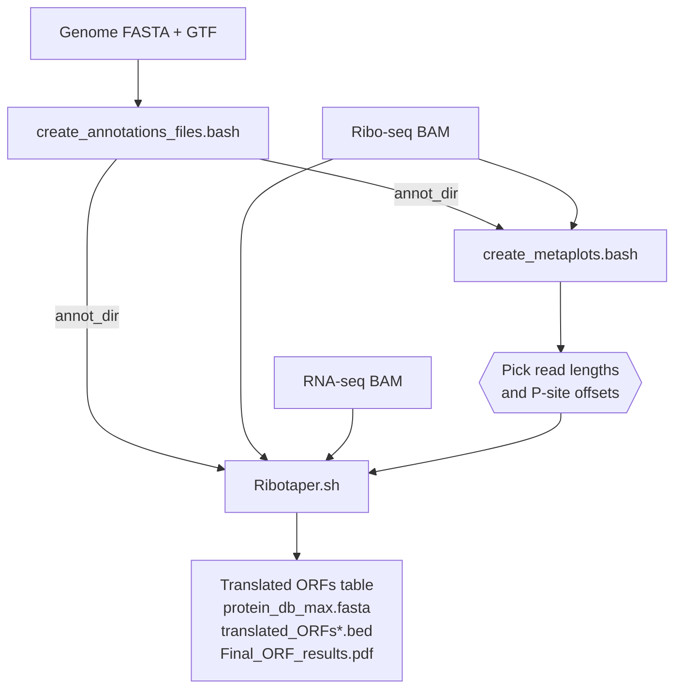

# RiboTaper (R 4.5 / modern-toolchain update)

*Identification of translated ORFs from Ribosome Profiling (Ribo-seq) data — updated to run on today's software.*


This is a maintained fork of **RiboTaper v1.3.1a** (Calviello *et al.*, *Nature Methods* 2016; Ohler lab, MDC Berlin). The original tool targets **bedtools v2.17, samtools 0.1.19 and R 3.0** and its build system actively refuses to configure against a modern bedtools. This version updates it to **bedtools ≥ 2.27, samtools ≥ 1.x and R ≥ 4.5** while keeping the scientific logic identical.

- **Original code:** <https://github.com/ohlerlab/RiboTaper>
- **What changed and why:** see [`CHANGES_MODERNIZATION.md`](CHANGES_MODERNIZATION.md)
- **Validated with:** bedtools 2.31.1, samtools 1.24, R 4.5.3 (full synthetic pipeline run — see `CHANGES_MODERNIZATION.md` §9)
- **Memory-efficient:** coverage-track building streams the BAMs (`bedtools coverage -sorted`) instead of loading them into RAM, so deep libraries don't run out of memory — see [Memory & performance](#memory--performance)

---

## Contents

- [What RiboTaper does](#what-ribotaper-does)
- [Requirements](#requirements)
- [Installation](#installation)
- [The workflow at a glance](#the-workflow-at-a-glance)
- [Quick start](#quick-start)
- [Step-by-step usage](#step-by-step-usage)
- [Input requirements (read this before running)](#input-requirements-read-this-before-running)
- [Output files & ORF categories](#output-files--orf-categories)
- [Choosing read lengths and P-site offsets](#choosing-read-lengths-and-p-site-offsets)
- [Memory & performance](#memory--performance)
- [Troubleshooting](#troubleshooting)
- [Repository layout](#repository-layout)
- [Citation & license](#citation--license)

---

## What RiboTaper does

RiboTaper uses the **3-nucleotide periodicity** of ribosome-protected fragments to statistically identify actively **translated open reading frames (ORFs)**. It combines a multitaper spectral test with an exact multinomial test on the per-codon distribution of P-sites, and reports translated ORFs (annotated CDSs, upstream/downstream ORFs, and ORFs in "non-coding" transcripts) together with a custom protein FASTA database for proteomics searches.

Inputs are aligned **Ribo-seq** and **RNA-seq** BAM files plus a genome and GTF annotation; outputs are tables of translated ORFs, BED tracks, a protein database and summary plots.

## Requirements

| Component | Minimum | Tested |
|-----------|---------|--------|
| Linux (CentOS/Rocky/Alma/Ubuntu…) | 64-bit | — |
| bedtools | **2.27.0** (unified `bedtools <subcommand>` interface) | 2.31.1 |
| samtools | **1.7** (HTSlib-based) | 1.24 |
| R | **4.0** (≥ **4.5** recommended) | 4.5.3 |
| R packages | `XNomial`, `multitaper`, `seqinr`, `ade4`, `doMC`, `foreach`, `iterators` | — |
| Cores | **≥ 2** | — |
| Memory (RAM) | scales with library size — see [Memory & performance](#memory--performance) | — |

> `XNomial` was archived on CRAN in 2021 and must be installed from the archive (handled automatically by [`extras/install_R_packages.R`](extras/install_R_packages.R)).

## Installation

The **conda/mamba** route is recommended on CentOS and HPC systems: it installs the entire stack in user space (no root) and is independent of the system's (often ancient) packages.

### Option A — conda / mamba (recommended)

```bash
# 0a. ALREADY HAVE conda (miniconda3 / anaconda)? Update it, and use the free
#     conda-forge + bioconda channels (this avoids Anaconda's paid "defaults" ToS):
conda update -n base -c conda-forge conda -y
conda config --add channels bioconda
conda config --add channels conda-forge
conda config --set channel_priority strict
conda install -n base -c conda-forge mamba -y        # optional: much faster solver

# 0b. ...or install Miniforge fresh (ships mamba, conda-forge by default):
#   curl -L -O https://github.com/conda-forge/miniforge/releases/latest/download/Miniforge3-Linux-x86_64.sh
#   bash Miniforge3-Linux-x86_64.sh -b -p $HOME/miniforge3 && source $HOME/miniforge3/etc/profile.d/conda.sh

# 1. Get the code
git clone https://github.com/hsinyenwu/RiboTaper_R4.5.git
cd RiboTaper_R4.5

# 2. Create the environment (modern bedtools / samtools / R)
mamba env create -f environment.yml
conda activate ribotaper

# 3. Install XNomial (patched for R ≥ 4.5) + multitaper
Rscript extras/install_R_packages.R

# 4. Build & install RiboTaper
chmod +x configure                    # GitHub web-upload can drop the exec bit
./configure --prefix=$CONDA_PREFIX/ribotaper
make && make install
export PATH="$CONDA_PREFIX/ribotaper/bin:$PATH"
```

Every new shell: `conda activate ribotaper` and re-`export PATH=...` (or add that line to `~/.bashrc`). If `./configure` is missing/outdated after upload, run `autoreconf -fi` first (autotools are in the env).

### Option B — Docker

```bash
docker build -t ribotaper:r4.5 .
docker run --rm -v "$PWD":/data -w /data ribotaper:r4.5 \
    Ribotaper.sh RIBO.bam RNA.bam annot_dir 26,28,29 9,12,12 4
```

### Option C — Apptainer / Singularity (HPC)

```bash
apptainer build ribotaper.sif apptainer.def
apptainer exec --bind "$PWD":/data ribotaper.sif \
    create_annotations_files.bash /data/annotation.gtf /data/genome.fa false false /data/annot_dir
```

### Option D — existing modules

If your cluster already provides new-enough bedtools/samtools/R (see the table above), just point `configure` at them:

```bash
./configure BEDTOOLS=$(command -v bedtools) SAMTOOLS=$(command -v samtools) \
            R=$(command -v R) RSCRIPT=$(command -v Rscript) --prefix=/usr/local/ribotaper
make && make install
Rscript extras/install_R_packages.R    # ensures XNomial is present
```

`configure` verifies every tool and R package and stops with a clear message if anything is missing or too old.

## The workflow at a glance



1. **`create_annotations_files.bash`** — build annotation files from your genome + GTF (run once per annotation).
2. **`create_metaplots.bash`** *(optional but important)* — metagene plots to choose the Ribo-seq read lengths and P-site offsets.
3. **`Ribotaper.sh`** — the full analysis: P-sites → coverage tracks → periodicity → ORF finding → protein DB → results.

## Quick start

```bash
conda activate ribotaper
export PATH="$CONDA_PREFIX/ribotaper/bin:$PATH"

# make sure the genome is indexed
samtools faidx genome.fa

# 1) annotation (once)
create_annotations_files.bash annotation.gtf genome.fa false false annot_dir

# 2) metagene plots -> inspect metaplots/*.pdf to choose lengths & offsets
create_metaplots.bash RIBO.bam annot_dir/start_stops_FAR.bed mysample

# 3) full analysis (run inside a fresh, empty working directory)
mkdir run && cd run
Ribotaper.sh /path/RIBO.bam /path/RNA.bam /path/annot_dir 26,28,29 9,12,12 4
```

## Step-by-step usage

### 1. `create_annotations_files.bash`

```
create_annotations_files.bash <gtf_file> <genome_fasta(indexed)> <use_ccdsid?> <use_appris?> <dest_folder>
```

| Argument | Description |
|----------|-------------|
| `<gtf_file>` | GTF with coding **and** non-coding genes (see [input requirements](#input-requirements-read-this-before-running)) |
| `<genome_fasta(indexed)>` | Genome FASTA, **not** repeat-masked, all uppercase; index with `samtools faidx` |
| `<use_ccdsid?>` | `true`/`false` — use the CCDS tag (valid for human GENCODE 19 / mouse GENCODE M3). `false` ⇒ every transcript with a CDS is treated as CCDS |
| `<use_appris?>` | `true`/`false` — use APPRIS tags to pick one principal transcript per gene (recommended for human/mouse to shrink the search space) |
| `<dest_folder>` | Output directory for the annotation files (reused in step 3) |

Key outputs include `unique_ccds.bed`, `unique_exons_ccds.bed`, `unique_nonccds.bed`, the `sequences_*` files, and **`start_stops_FAR.bed`** (used by the metagene step).

### 2. `create_metaplots.bash` *(optional, choose P-site parameters)*

```
create_metaplots.bash <ribo.bam> <bedfile> <name>
```

`<bedfile>` is `annot_dir/start_stops_FAR.bed` from step 1. Produces `metaplots/<name>_<length>.pdf` — aggregate P-site profiles around start/stop codons for each read length, so you can read off which **read lengths** are periodic and at what **offset** the P-site sits. The BAM is auto-downsampled to 10% to keep RAM low.

### 3. `Ribotaper.sh` (main pipeline)

```
Ribotaper.sh <Ribo_bam> <RNA_bam> <annotation_dir> <read_lengths> <offsets> <n_cores>
```

| Argument | Description |
|----------|-------------|
| `<Ribo_bam>` | Ribo-seq alignments (same genome as the annotation) |
| `<RNA_bam>` | RNA-seq alignments (same genome) |
| `<annotation_dir>` | Directory from step 1 |
| `<read_lengths>` | Comma-separated read lengths to use, e.g. `26,28,29` |
| `<offsets>` | Comma-separated P-site offsets, one per read length, e.g. `9,12,12` |
| `<n_cores>` | Number of cores (**≥ 2**) |

Internally it filters the BAMs (unique: `-q 50`; primary: `-F 0x100`), computes P-sites, builds coverage tracks, tests periodicity, annotates exons, finds ORFs in CCDS and non-CCDS genes, and writes the final ORF table + protein database. Run it inside a fresh working directory (it writes many intermediate files to the current directory).

> **Restart from ORF finding:** `Ribotaper_ORF_find.sh` takes the same arguments and reuses the tracks/exon calculations from a previous successful run.

## Input requirements (read this before running)

These constraints come from the original RiboTaper and still apply:

1. **Chromosome names must match** across the GTF, FASTA and BAMs, and must **not contain underscores (`_`)**.
2. The **GTF must contain coding and non-coding genes**. If you use StringTie/Cufflinks transcripts, `cat` them with a standard annotation that has CDS features.
3. Every `exon` and `CDS` line needs a **`transcript_id`** and **`gene_id`**; a `gene_type`/`gene_biotype` field is reported in the output `annotation` column (`no_biotype` otherwise).
4. The **genome FASTA must be non-masked and uppercase** (e.g. `ATGC…`, not `atgc…`).
5. Watch out for scaffolds in both the genome and GTF.
6. Underscores in gene/transcript IDs are converted to dashes (`-`).
7. RiboTaper reports an ORF as soon as it finds one on a transcript — **transcript annotation is crucial**; it does not deconvolve reads between isoforms.
8. Ribo-seq and RNA-seq must be aligned to the **same genome** (ideally the same GTF) used for the annotation.

## Output files & ORF categories

Main results (in your working directory after `Ribotaper.sh`):

| File | Description |
|------|-------------|
| `ORFs_max` | All translated ORFs found |
| `ORFs_max_filt` | Filtered for multimapping / non-coding overlaps — **recommended for downstream analysis** |
| `protein_db_max.fasta` | Custom protein database (for MS/proteomics searches) |
| `translated_ORFs_sorted.bed` / `translated_ORFs_filtered_sorted.bed` | BED tracks of translated ORFs |
| `ORFs_genes_found` | Counts of ORFs and their genes |
| `Final_ORF_results.pdf` | Summary plots (length/coverage per ORF category) |
| `quality_check_plots.pdf` | QC plots (coverage/length/periodicity diagnostics) |

**ORF categories reported:**

- `ORFs_ccds` — in CCDS genes, overlapping an annotated CDS
- `uORFs` / `dORFs` — upstream / downstream ORFs in CCDS genes, not overlapping coding exons
- `nonccds_coding_ORFs` — in non-CCDS genes but overlapping coding exons
- `ncORFs` — in non-CCDS genes, not overlapping any coding exon (e.g. ORFs in lncRNAs)

## Choosing read lengths and P-site offsets

This is the **single most important decision** in the pipeline. Different read lengths place the ribosomal P-site at different offsets from the read 5′ end, and only some lengths show clean 3-nt periodicity. Use `create_metaplots.bash` and inspect the metagene PDFs: pick the read lengths whose aggregate profile is sharply periodic around start/stop codons, and read off the offset (distance from the 5′ end to the first strongly periodic position). Typical values are ~26–30 nt with offsets ~9–13, but they are **protocol- and dataset-specific** — do not assume the defaults.

If you already have P-site positions, put a 6-column, 1-nt BED file named `P_sites_all` in the working directory and RiboTaper will use it.

## Memory & performance

The heaviest steps are P-site calculation and coverage-track building (in `Ribotaper.sh`) and the per-exon multitaper analysis in R.

**Coverage is memory-efficient in this build.** bedtools ≥ 2.24 computes `coverage` for the `-a` file and loads `-b` into RAM. The original code streamed the BAM, but the `-a`/`-b` swap required for correct modern semantics would otherwise load the (large) BAMs into memory and can be OOM-killed on real data. This fork instead streams the BAM coverage with `bedtools coverage -sorted` (reusing the BAMs' existing coordinate sort), so memory stays low and flat regardless of BAM size — with **byte-identical output**. (See `CHANGES_MODERNIZATION.md` §3.1.)

**How to tell you ran out of memory.** An out-of-memory kill doesn't always stop the job with an obvious error — instead a coverage step is killed mid-write and leaves a **0-byte output file**, and the run then fails later in `tracks_analysis.R` (typically a `read.table` error). So after a run, check the sizes of the count/track files in your output directory:

```bash
ls -l *_counts_* data_tracks/*_tracks_*
```

If any of these come out **0 bytes** (commonly `RIBO_best_counts_*` and `RIBO_tracks_*`, since the Ribo-seq BAM is usually the largest input), the job hit its memory ceiling — **request more memory and resubmit.** On SLURM, `seff <jobid>` confirms it (`State: OUT_OF_MEMORY`, Memory Efficiency ~100%) and reports the actual peak usage, so you can raise `--mem` accordingly and right-size future jobs.

Memory scales mainly with the `P_sites_all` / `Centered_RNA` point files and the R analysis, not with the BAMs. RiboTaper requires **≥ 2 cores**; more cores speed up the R steps, but each worker holds data, so memory grows modestly with core count.

## Troubleshooting

- **`bedtools getfasta` silently skips regions / few ORFs found** → your genome `.fai` index is stale. Re-run `samtools faidx genome.fa` after any change to the FASTA.
- **`configure` errors that a tool is too old** → install via `environment.yml`, or point `configure` at newer binaries (Option D).
- **`R package XNomial could not be loaded`** → run `Rscript extras/install_R_packages.R`.
- **"n of cores required >1"** → pass `<n_cores>` ≥ 2.
- **Job OOM-killed at "Creating tracks", or empty `RIBO_best_counts_*` followed by a `tracks_analysis.R` `read.table` error** → make sure you reinstalled the current build (BAM coverage now streams via `bedtools coverage -sorted`); if a later step still runs out of memory, raise `--mem` (see [Memory & performance](#memory--performance)).
- **Empty/failed run** → confirm chromosome names match across FASTA/GTF/BAM and contain no underscores; confirm the GTF has both coding and non-coding genes.
- **Old CentOS 7 + conda glibc errors** → use the Apptainer/Docker image instead (Options B/C).

## Repository layout

```
.
├── README.md                     # this file
├── CHANGES_MODERNIZATION.md      # every change vs. the original, with rationale
├── INSTALL_MODERN.md             # condensed install guide
├── environment.yml               # conda/mamba environment
├── Dockerfile                    # container build
├── apptainer.def                 # Apptainer/Singularity build
├── extras/
│   └── install_R_packages.R      # installs XNomial (patched) + multitaper
├── configure  configure.ac  Makefile.am  Makefile.in  aclocal.m4  build-aux/  m4/
└── scripts/                      # the RiboTaper pipeline (bash + R)
```

## Citation & license

If you use RiboTaper, please cite the original method:

> Calviello L, Mukherjee N, Wyler E, Zauber H, Hirsekorn A, Selbach M, Landthaler M, Obermayer B, Ohler U. **Detecting actively translated open reading frames in ribosome profiling data.** *Nature Methods* 13, 165–170 (2016). doi:10.1038/nmeth.3688

RiboTaper is free software under the **GNU General Public License v3** (see the license notice in each script). This fork only modernizes the toolchain; the algorithm and its authorship are unchanged.
